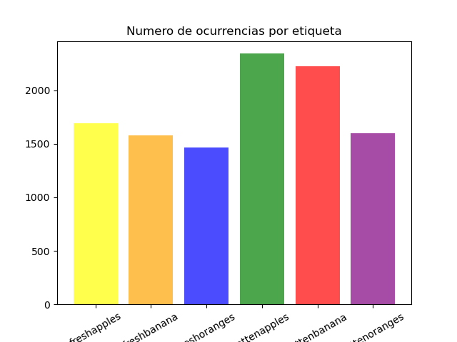

# MonitoreoDeFrutas
Proyecto final para la materia Seminario de Investigación.

El presente proyecto tiene como propósito ayudar a clasificar frutas que se encuentran en buen estado y frutas en estado de descomposición.

El código se divide en dos partes:

1. El código con el que entrenamos el modelo.
2. El código en el que se usa el modelo para aplicarlo a casos específicos.

Nota: el dataset usado para entrenar el modelo fue tomado de [kaggle](https://www.kaggle.com/datasets/sriramr/fruits-fresh-and-rotten-for-classification)

## Estructura del proyecto

Como se mencionó antes el proyecto se divide en dos partes el modelo y la solución.

### Modelo

Dentro de la estructura del proyecto se encuentra la carpeta **modelo** aquí se encuentra el código necesarrio para entrenar el modelo y aunque se incluye la carpeta **data** en realidad no se incluye el dataset pues debido a la cantidad de fotografías el repositorio se volvería demasido pesado (se debe descargar por separado si se quiere ejecutar en local).
Se recomienda usar esta ruta para guardar la training data, pero en el archivo modelo se puede modificar la ruta.

En esta carpeta se incluye el archivo **modelo.keras** que incluye el modelo ya entrenado.

### Solución

Al mismo nivel que la carpeta **modelo** encontramos la carpeta **solucion** aqui es donde encontramos el código de la aplicación que usa el modelo que entrenamos en la otra sección de código, no es necesario entrenar el modelo cada vez que se quiere ejecutar la aplicación.

## Como ejecutar el código

Para ejecutar este código de manera local, podemos únicamente ejecutar la aplicación que hace uso del modelo previamente entrenado, o podemos realizar el paso donde se hace el entrenamiento de manera local. A continuación se exponen los pasos a seguir para ejecutar los distintos pasos.

### Pre-requisitos

Es importante tener un ambiente adecuado para ejecutar los componentes, en especial es importante que las versiones sean las correctas, a continuación se presentan los componentes y versiones con las que el modelo fue probado:

|Dependencia |Version |
|------------|--------|
|python      | 3.8.19 |
|tensorflow  | 2.3.0  |
|matplotlib  | 3.7.2  |
|pandas      | 2.0.3  |
|numpy       | 1.23.5 |

### Ejecucion del modelo (Paso opcional)

**Nota** Es importante resaltar que no es estrictiamente necesaria la ejecución del modelo para ejecutar la solución.

En primer lugar para ejecutar el modelo debemos estar seguros de las rutas necesarias estan bien establecidas, al inicio del archivo python tenemos 3 rutas que hay que modificar:

- RUTA_ENTRENAMIENTO = 'C:/Users/jbior/Documents/proyecto/MonitoreoDeFrutas/modelo/data/archive/dataset/train/'
- RUTA_PRUEBAS = 'C:/Users/jbior/Documents/proyecto/MonitoreoDeFrutas/modelo/data/archive/dataset/test/'
- RUTA_MODELO = 'C:/Users/jbior/Documents/proyecto/MonitoreoDeFrutas/modelo/'

Estas rutas representan respectivamente la ruta donde se encuentran los archivos de entrenamiento, la ruta donde se encuentran los archivos de prueba y la ruta donde se guarda el modelo keras ya entrenado.

Adicionalmente se tiene una variable llamada **ejecucion_con_grafica** en el código esta definida como False, con esto se evita que se muestre una grafica de barras que muestra el número de coincidencias por categoría. Lo anterior no es parte de la creación del modelo sino una exploración inicial, no es estrictamente necesario ejecutar ese código, pero se deja en caso de que se quiera hacer una análisis exploratorio inicial de los datos.  Para poder ver la gráfica habría que definir el valor de la varibale como True.

Este es un ejemplo de la gráfica generada:

### Ejecutar la aplicación

WIP
